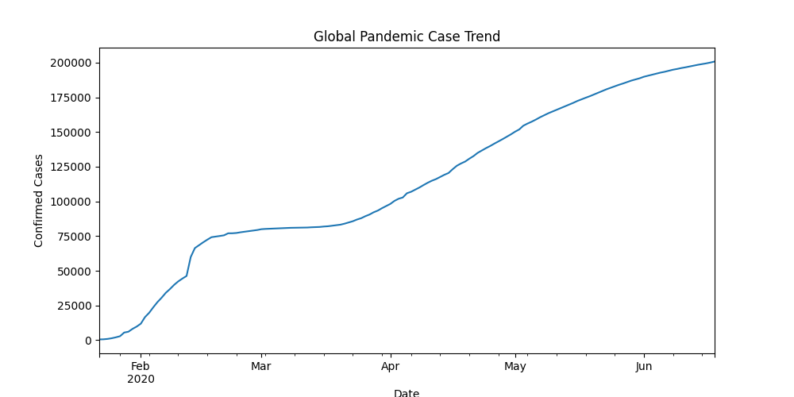
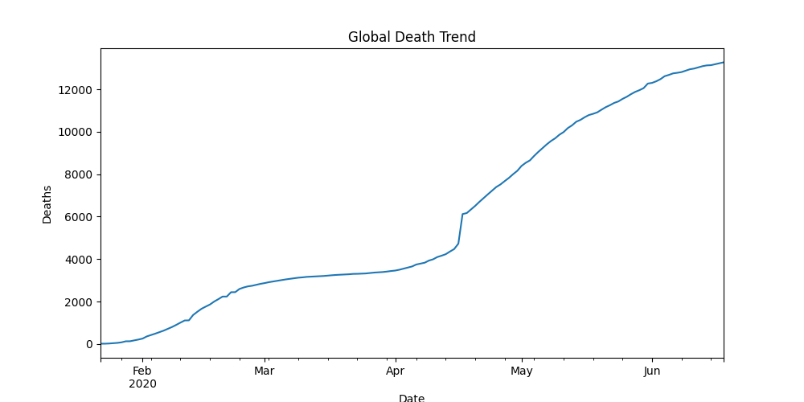
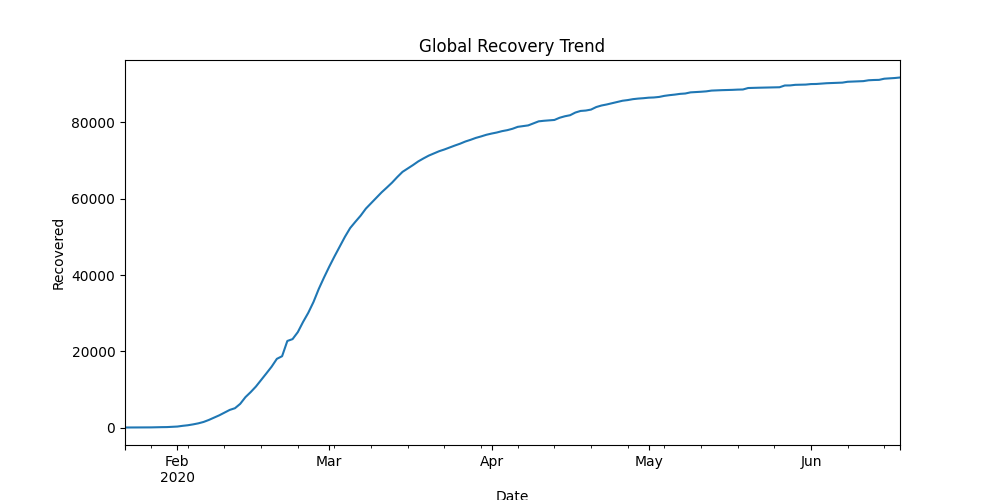
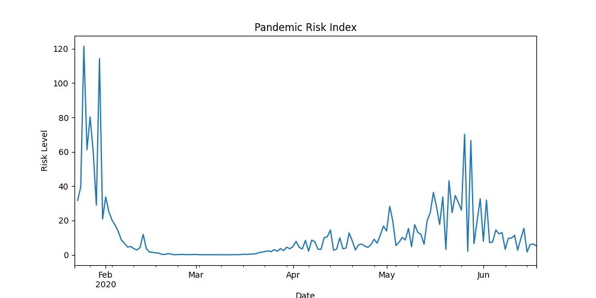

# 🦠 Pandemic Risk Analyzer

An AI-driven data science project analyzing global pandemic trends and estimating risk progression using real-world COVID-19 datasets.

---

## 🚀 Project Overview

This project converts academic research in data science into an applied analytical system.

The Pandemic Risk Analyzer studies historical pandemic data to:

- Track global case growth
- Analyze recovery vs active case dynamics
- Visualize pandemic evolution
- Compute a custom **Pandemic Risk Index**

---

## 🧠 Motivation

During my research work in Data Science, I explored how data-driven decision systems can help predict and understand large-scale health crises.

This repository demonstrates how research concepts can be transformed into practical analytical tools.

---

## 📊 Dataset

Source: Johns Hopkins COVID-19 Global Dataset

Data Includes:
- Confirmed Cases
- Deaths
- Recoveries
- Active Cases
- Geographic Regions
- Time Series Trends

---

## ⚙️ Tech Stack

- Python
- Pandas
- Matplotlib
- Jupyter Notebook
- Data Visualization

---

## 📈 Key Visualizations

### Global Case Trend

### Death Trend

### Recovery Trend

### Pandemic Risk Index

---

## 🧪 Pandemic Risk Index

Custom metric:

Risk Index = Active Cases / Recovered Cases

This indicator helps measure ongoing strain during pandemic phases.

---

## 📂 Project Structure
pandemic-risk-analyzer
│
├── data/
├── images/
├── notebooks/
│ └── analysis.ipynb
└── README.md

---

## 🔬 Research Background

- Published Data Science Research Author
- Two-time Best Research Paper Award Winner
- Focus Areas:
  - Data Analytics
  - Predictive Modeling
  - AI-driven Decision Systems

---

## 🔮 Future Improvements

- Machine Learning prediction models
- Real-time dashboard
- Pandemic outbreak forecasting
- Risk classification using ML algorithms

---

## 👨‍💻 Author

**Shllok Tahiliani**

B.Tech AI & Data Science Engineering  
10 CGPA (Semester 1)  
JEE Mains: 97.4 Percentile  
IGCSE: 95.86% (7 A*)
